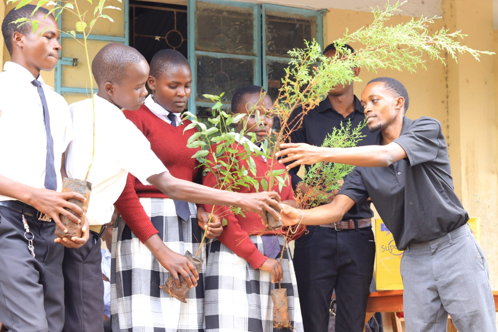
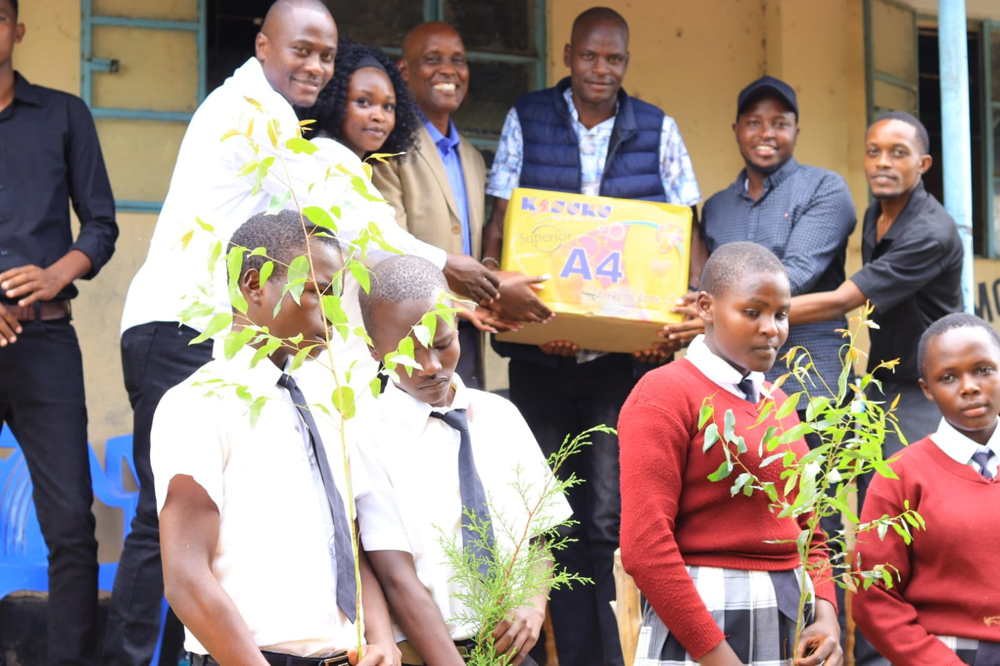
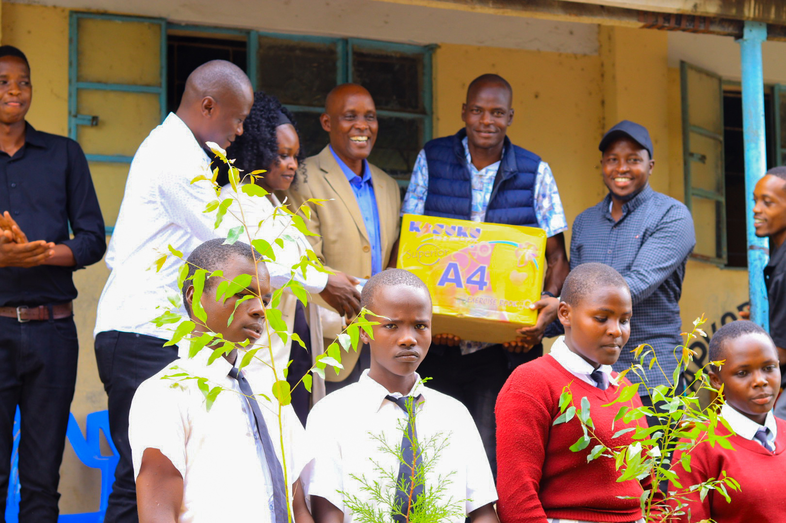
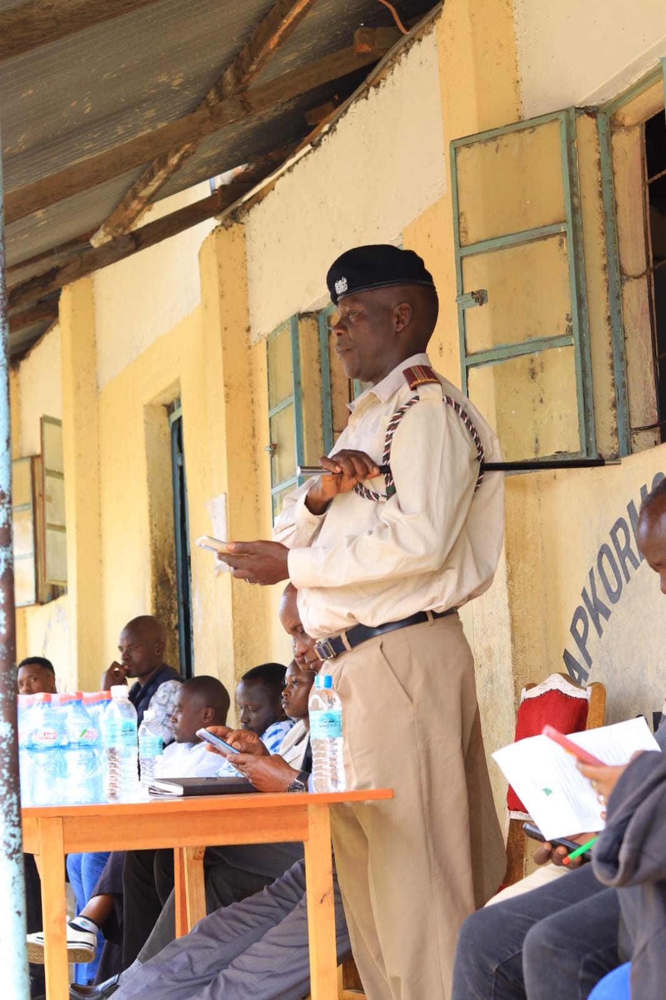
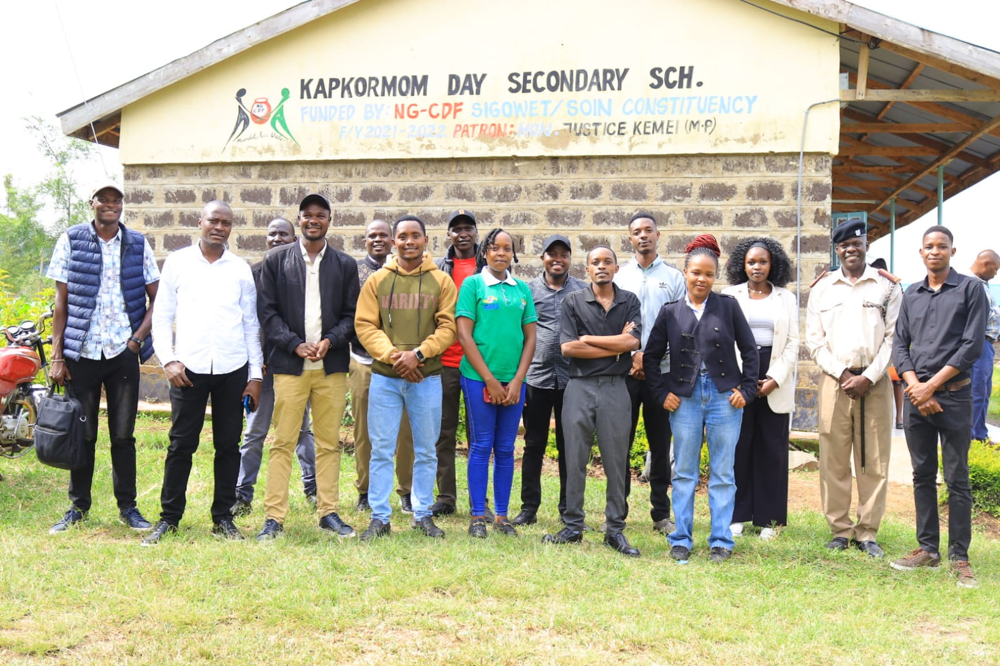
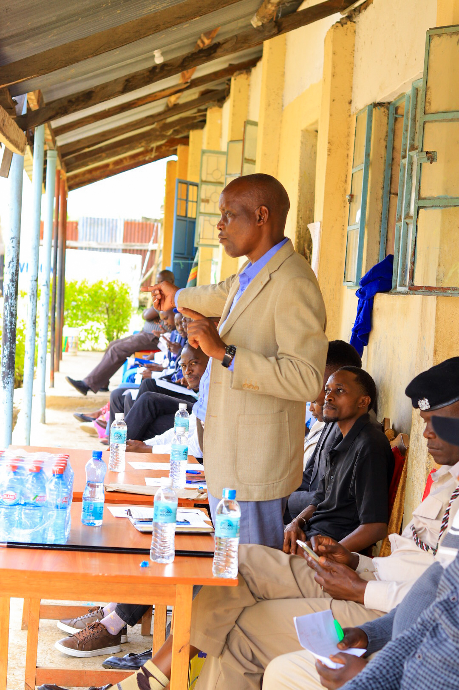
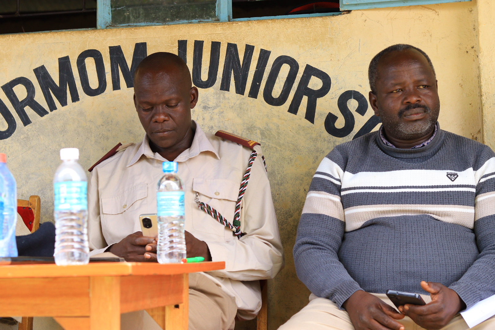
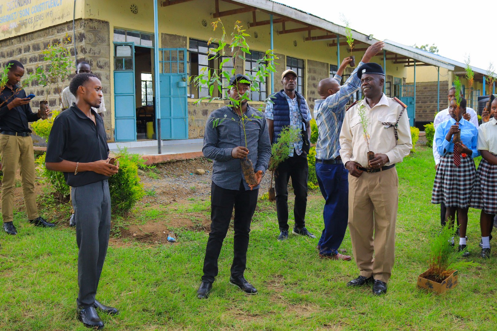

# 🌍 GreenMinds KE Charity Drive

GreenMinds KE is a youth-led community organization based in Kenya. We integrate environmental stewardship, education resource distribution, and foundational career mentorship to empower the next generation.

---

## 🌳 1. Environmental Conservation & Tree Planting
We conduct regional tree-planting campaigns to create green spaces and fight climate change locally.
* **Our Goal:** Promoting biodiversity and environmental responsibility among youth.

  
  

---

## 📚 2. Education Support & A4 Book Donations
We bridge educational resource gaps by providing foundational stationery materials directly to students in underfunded schools.
* **Impact:** Distributing A4 exercise books to support standard classroom learning and writing retention.

  
  

---

## 🩸 3. Welfare & Sanitary Pad Distributions
Our welfare team works to fight period poverty, ensuring young schoolgirls maintain personal hygiene with dignity and never miss school days.

  

---

## 📢 4. School Career Talks & Mentorship
As university students and industry professionals, we visit secondary schools to give impactful talks on academic pathways, career navigation, and personal development.

  
  
  

  
  

---

## 🤝 Partners & Volunteering
Want to support GreenMinds KE? Contact us through our leadership panel or track our real-time community efforts right here on GitHub.

