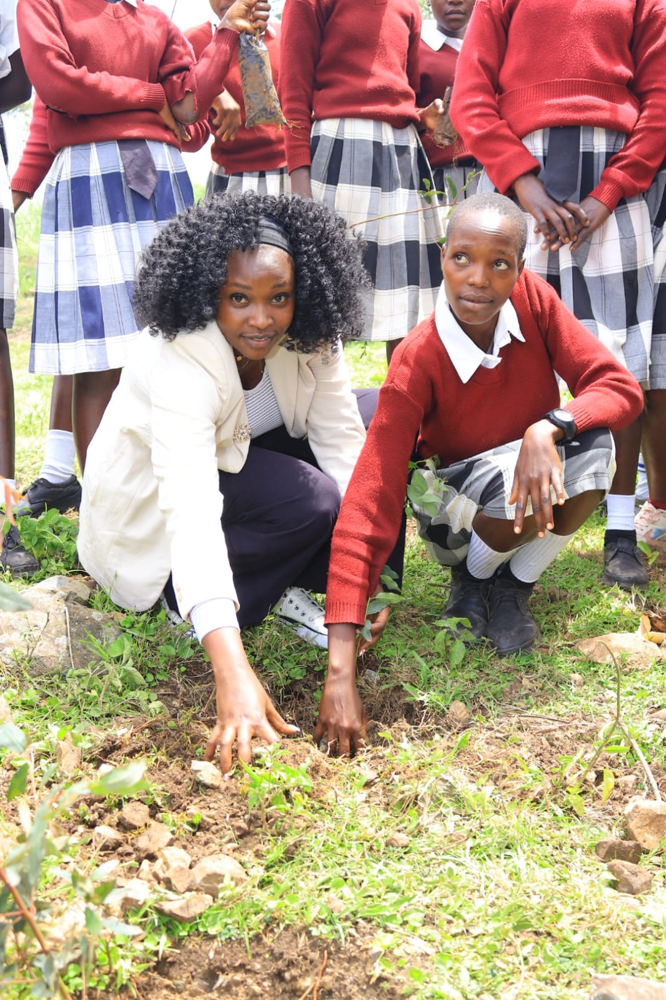

# 🌍 GreenMinds KE Charity Drive

GreenMinds KE is a community-led charity dedicated to environmental conservation, education support, and youth mentorship in Kenya. 

## 🚀 Our Impact & Initiatives

### 🌳 1. Environmental Conservation & Tree Planting
We organize regional tree-planting campaigns to combat deforestation and promote environmental sustainability.

### 📚 2. Education & Welfare Support
We support underserved students by distributing essential learning materials and hygiene products.
* **Sanitary Pad Donations:** Empowering young girls to stay in school with dignity.
* **A4 Exercise Books:** Providing critical writing materials to primary and secondary students.

### 📢 3. Career Talks & Mentorship
We deliver actionable career guidance and academic mentorship sessions to high school students to help shape the next generation of leaders.
